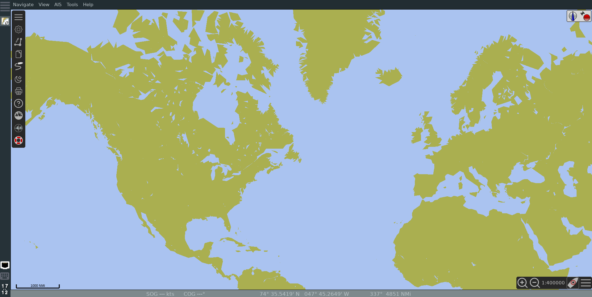
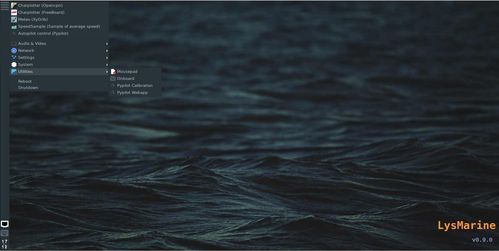
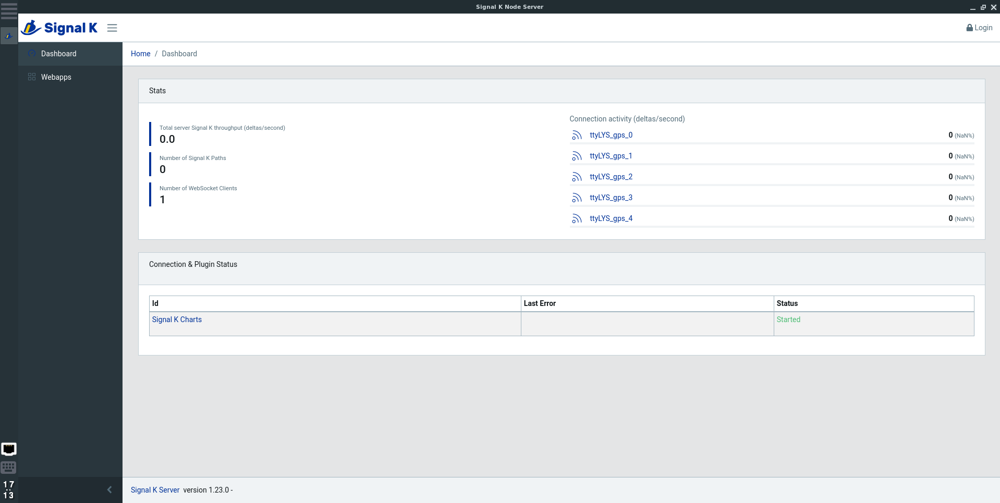

# Lysmarine

## A stable and coherent operating system for DIY chart plotters.

  

    
  

  

    
  

  

    
  

  

    
  

  

  

    
  

  

    
  

  

    
  

  
  

    
  

  
  

  

    
  

  

    
  

    

    
  

    

    
  

  
  

    

    
  

<!-- The expanding image container -->

  <!-- Close the image -->
  &times;

  <!-- Expanded image -->
  

  <!-- Image text -->
  

 

 
# Feature

 * OpenCPN
 * Freeboard-sk
 * XyGrib
 * Pypilot
 * SignalK
 * kplex
 * gpsd
 * vnc

# Hardware requirements.

At this time, The tested SBCs are :

* RaspberryPi 3
* PineA64 LTS (based on the Pine64so kernel)
* virtualbox disk image

Others SBC related suported arch might work out of the box but haven't been tested, others might need tweeks to build correctly.

If you wish to have your favorite SBC supported and have some time to do testing ...or have a spare to giveaway. Open a github issue or contact me on facebook https://fb.me.com/lysmarineOS/

# Get Starded
&nbsp; &nbsp; &nbsp; &nbsp; [ Download and Install ](doc/INSTALL.md)

&nbsp; &nbsp; &nbsp; &nbsp; [ Documentation ](doc/README.md)

# Contact
&nbsp; &nbsp; &nbsp; &nbsp;[Get in touch with the community](https://www.facebook.com/groups/1072445939633174/)

&nbsp; &nbsp; &nbsp; &nbsp;[Bugs and Issues](https://github.com/lysmarine/lysmarine_gen/issues)

&nbsp; &nbsp; &nbsp; &nbsp;[Facebook](https://www.facebook.com/lysmarineOS)
