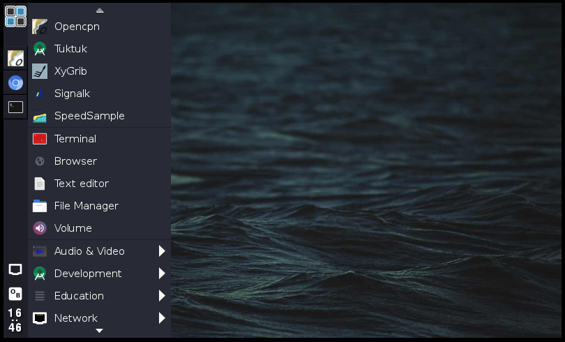
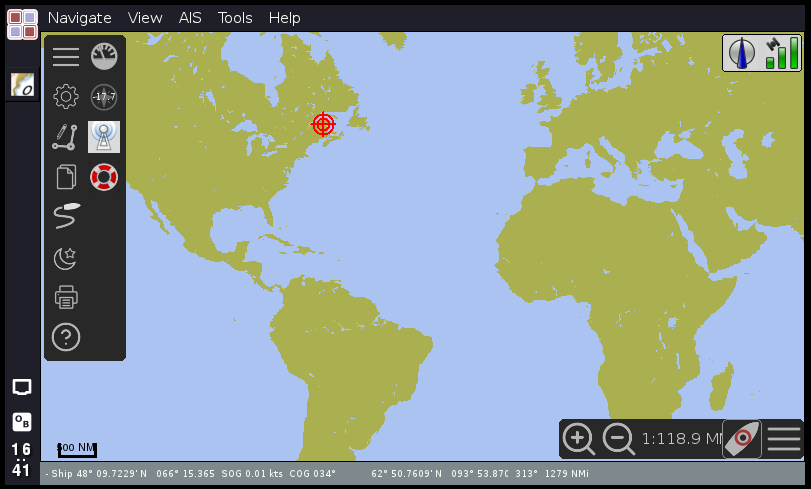
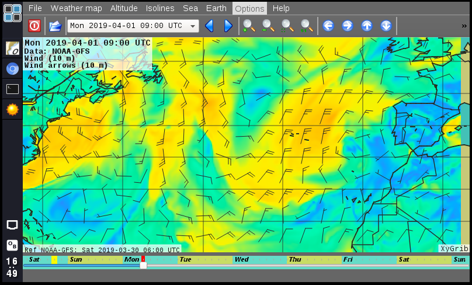

# What is Lysmarine.
Lismarine is an operating system designed to be used as a navigation computer inside boats.
The software is build with pi-gen so it's use the same base as raspbian and it's compiled for raspberrypi.
It include software to read charts, Gribs, go on the internet and manage different inputs and outputs such as autopilots, GPS, AIS, depth sensors ....

# Hardware requirements.
In order to make the magic of Lysmarine append, you will need some physical devices to run your software on.
What you will need will vary a lot depending your inputs and outputs and mainly your geek level.

The minimum kit can be found on the [Minimal Hardware](doc/userdoc/hardware/minimal_hardware.md)

# Get Starded
&nbsp; &nbsp; &nbsp; &nbsp; [ Download and Install ](INSTALL.md)

&nbsp; &nbsp; &nbsp; &nbsp; [ First run, What to do ](doc/userdoc/firstboot.md)

# Documentation
&nbsp; &nbsp; &nbsp; &nbsp; [ For project Contributors ](doc/contrib/README.md)

&nbsp; &nbsp; &nbsp; &nbsp; [ For users and hackers ](doc/userdoc/README.md)

# Contact
&nbsp; &nbsp; &nbsp; &nbsp;[Get in touch with the community](https://www.facebook.com/groups/1072445939633174/)

&nbsp; &nbsp; &nbsp; &nbsp;[Bugs and Issues](https://gitlab.com/lysmarine/lysmarine/issues)

&nbsp; &nbsp; &nbsp; &nbsp;[Facebook](https://www.facebook.com/lysmarineOS)
