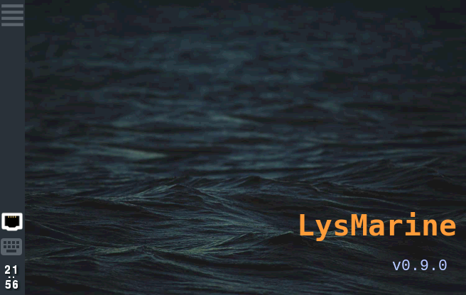
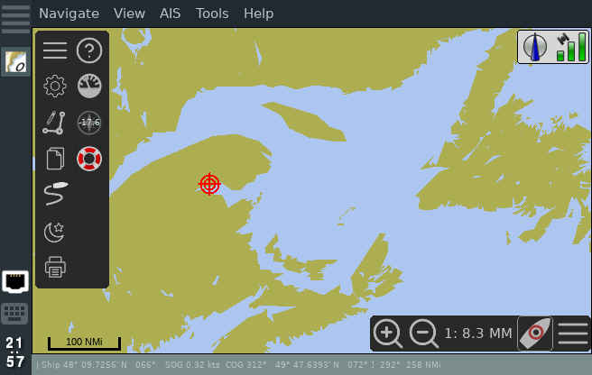
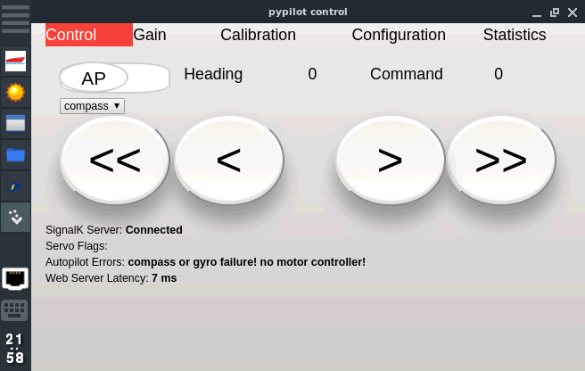
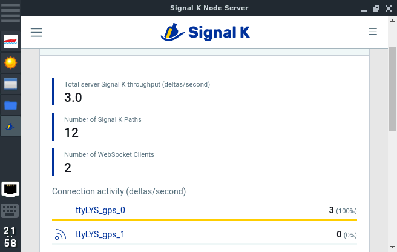
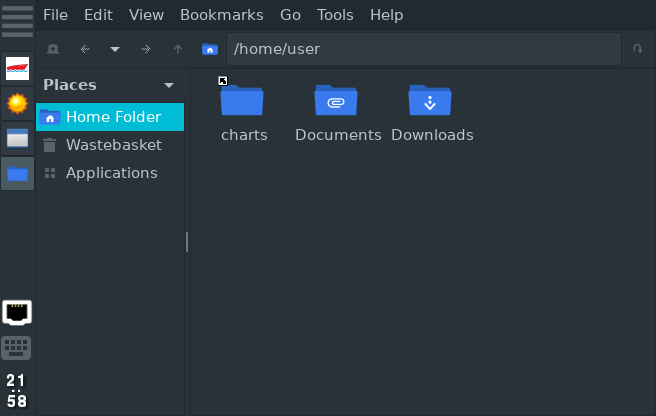
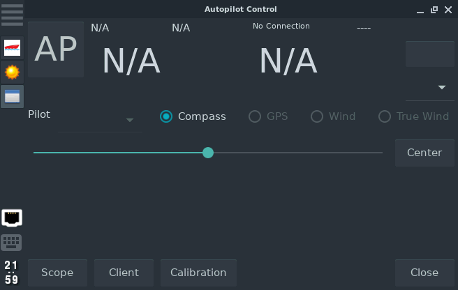
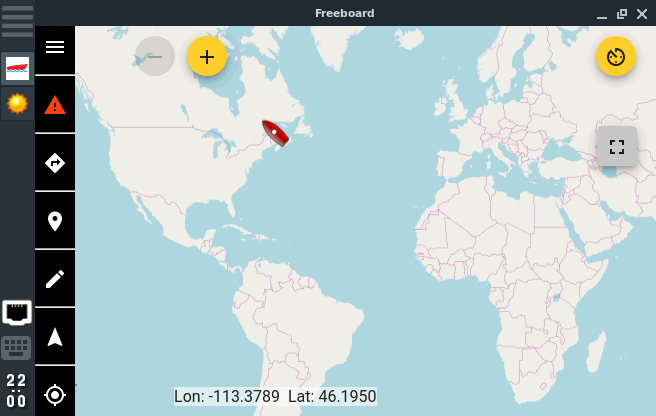
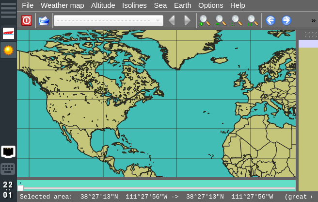
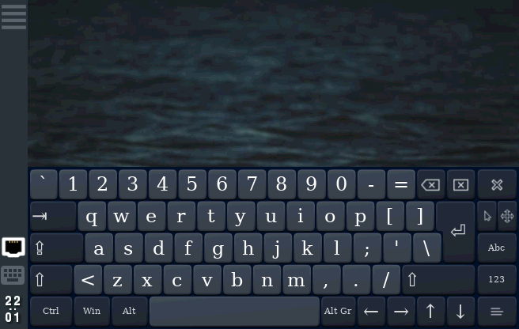
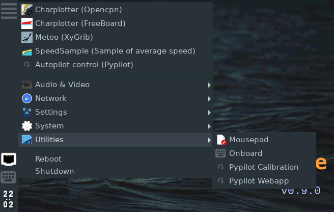

## Lysmarine is a stable and coherent operating system with a nice interface for DIY chart plotters.

  <ul class="flip-items">
     <li data-flip-title="Desktop">
        
    </li>
     <li data-flip-title="OpenCPN">
        
     </li>
     <li data-flip-title="PyPilot">
        
     </li>
     <li data-flip-title="SignalK">
        
     </li>
     <li data-flip-title="PcmanFm">
        
     </li>
     <li data-flip-title="pyPilot">
        
     </li>
     <li data-flip-title="Freeboard-sk">
        
     </li>
     <li data-flip-title="XyGrib">
        
     </li>
     <li data-flip-title="onBoard">
        
     </li>
     <li data-flip-title="OpenBox">
        
     </li>

  </ul>

 
 
 
 
 
### The Core principles that define Lysmarine
  - Support most Popular SBC and Computers. 
  - Based On Debian or it's SBC derivative. 
  - Strong respect of the Linux FHS and philosophy.
  - Strong use of systemD.
  - Everything goes through SignalK.
  - The UI/UX reflect commercial Chartplotter design.
  - Fix and adapt software upstream as possible. So it can benefit the community not just lysmarine users.   

### Documentation and Tutorials 
  - [ Install Lysmarine on your hardware ](doc/INSTALL.md)
  - [ Complete Documentation ](doc/README.md)

